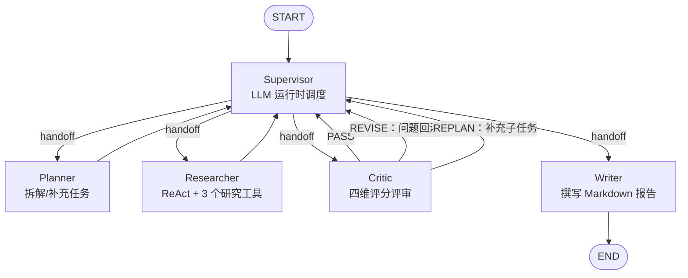

# 多智能体研究助手 · Multi-Agent Research Assistant

输入一个研究问题，系统自主完成 **任务拆解 → 多源资料检索 → 质量评审与迭代返工 → 撰写带引用的 Markdown 报告**。
基于 LangGraph 的 **Supervisor 多智能体架构**，调度决策由 LLM 在运行时做出，而非写死的流水线。

默认使用通义千问 `qwen3.8-flash`（阿里云百炼 OpenAI 兼容端点，可在 `.env` 换成 `qwen3.8-max` 等）+ 免费的 [arXiv](https://arxiv.org) 论文接口；
也可在 `.env` 中切换 Groq / DeepSeek / OpenAI 等任意 OpenAI 兼容服务，配置 Tavily Key 后可联网搜索任意网页。

---

## 它为什么是一个 Agent（而不只是 LLM 工作流）

| Agent 特征 | 本项目实现 |
|---|---|
| **运行时自主决策** | `Supervisor` 是 LLM 节点，每一步通过 `handoff_to` 工具调用动态决定下一个执行的智能体（`Command(goto=...)`），代码只做合法性校验与规则兜底 |
| **自主工具使用** | `Researcher` 绑定 3 个真实工具（网页搜索 / 网页正文抓取 / arXiv 检索），自行决定搜什么、用哪个工具、搜几轮 |
| **自主终止** | Researcher 判断资料充分后调用终态工具 `submit_finding` 宣布任务完成，而不是由固定循环次数决定 |
| **反馈闭环** | Critic 产出的结构化问题会进入 Researcher 下一轮 prompt，不合格任务被重置为 `pending` 并按 revision 迭代 |
| **动态重规划** | Critic 可以判定"题目没拆全"（REPLAN），Planner 基于已有结论补充新子任务，而不是拆一次就固定 |

图只定义"可能的拓扑"，实际执行路径每跑一次都可能不同。

## 架构



所有节点通过同一个"黑板"状态（[`state.py`](state.py)）协作：

```
query → tasks → findings ⇄ critique(issues) → report_markdown
```

## 研究工具

| 工具 | 用途 | 是否需要 Key |
|---|---|---|
| `web_search` | Tavily 联网搜索（新闻、博客、官方文档） | 需要 `TAVILY_API_KEY`（免费额度） |
| `fetch_webpage` | 抓取任意 URL 并自动清洗正文 | 否 |
| `search_arxiv` | arXiv 论文检索（标题/作者/日期/摘要） | 否 |

工具失败不会中断流程——智能体会自行换关键词或换工具继续。

## 快速开始

**环境要求：** Python 3.10+

```bash
# 1. 安装依赖
pip install -r requirements.txt

# 2. 配置环境变量
cp .env.example .env
#    编辑 .env，填入真实密钥：默认走阿里云百炼（需同时填 LLM_MODEL / LLM_BASE_URL / LLM_API_KEY，
#    示例端点已在 .env.example 中给出），也可换 qwen3.8-max / Groq 等
#    Tavily Key 可选，不填也能用 arXiv + 网页抓取完成研究
#    （启动时会做配置预检：LLM Key 缺失或仍是占位符会快速报错并说明原因）

# 3. 运行
python main.py "RAG 检索增强生成在 2025 年有哪些重要进展？"
```

不带参数进入交互模式：

```bash
python main.py
```

报告默认保存到 `reports/时间戳-问题.md`。

## 命令行参数

```
python main.py [问题] [选项]

  --model <provider/model>     覆盖默认模型，例如：
                                 qwen3.8-flash（默认，配合 LLM_BASE_URL / LLM_API_KEY）
                                 groq/llama-3.3-70b-versatile
                                 openai/gpt-4o-mini
                                 deepseek/deepseek-chat
  --max-iterations <N>         评审-返工最大轮数（默认 4，防止无限返工）
  --output, -o <path>          指定报告输出路径
  --no-save                    只打印，不落盘
  --quiet, -q                  静默模式，只输出报告
```

也支持任意 OpenAI 兼容端点（本地 vLLM/Ollama、国内厂商、中转等），在 `.env` 中设置
`LLM_MODEL=<模型名>`（或 `custom/<模型名>`）、`LLM_BASE_URL`、`LLM_API_KEY` 即可；
不带供应商前缀且配置了 `LLM_BASE_URL` 时，自动按自定义兼容端点处理。

## 执行过程示例

```
研究问题：RAG 检索增强生成在 2025 年有哪些重要进展？
----------------------------------------------------------------
  • Supervisor → planner：唯一合法路径：planner
  • Planner：制定 4 个子任务（覆盖原理、方法、进展、局限）
  • Supervisor → researcher：唯一合法路径：researcher
  • Researcher：完成任务 t1「RAG 的核心原理与典型架构…」（第 1 版，搜索 3 次，抓取 1 次，来源 4 条，可信度 high）
  • Researcher：完成任务 t3「2024–2025 年的代表性新方法…」（第 1 版，搜索 4 次，来源 5 条，可信度 high）
  ...
  • Critic：第 1 轮评审 → REVISE，得分 13/20，打回任务 ['t4']：缺少对评测基准与失败模式的讨论
  • Researcher：完成任务 t4「RAG 的局限、失败模式与评测…」（第 2 版，搜索 2 次，来源 3 条，可信度 medium）
  • Critic：第 2 轮评审 → PASS（17/20）
  • Writer：已生成最终研究报告
```

## 项目结构

```
.
├── main.py            # CLI 入口 + 流式核心 stream_research（CLI/Web/Streamlit 共用）
├── app.py             # Streamlit 界面（本地快速验证用）
├── web/               # L2 生产服务：FastAPI + 古典风格前端
│   ├── server.py      #   /api/research(SSE) · /api/health · 静态托管 · Basic Auth
│   ├── auth.py        #   凭据校验 + 进程内令牌桶限流
│   └── static/        #   index.html / style.css / app.js（无框架，纸感学术风）
├── graph.py           # LangGraph 图：Supervisor 星型拓扑
├── agents.py          # 五个智能体 + 截断重试 + 引用可信度校验
├── tools.py           # 研究工具集 + SSRF 防护（is_blocked_url）
├── llm.py             # 多供应商 LLM 工厂 + per-request 模型注入（contextvar）
├── state.py           # 共享黑板状态定义（TypedDict + reducer）
├── Dockerfile         # 非 root 镜像 + 健康检查
├── docker-compose.yml # 环境变量注入密钥，仅本机暴露端口
├── deploy/nginx.conf  # 反代 + SSE 参数 + QPS 限流 + HTTPS 模板
├── DEPLOY.md          # L2 部署指南
├── LAUNCH_CHECKLIST.md # 上线前可勾选核对清单
├── .streamlit/        # Streamlit 运行配置
├── tests/             # 离线单元与集成测试（路由、来源、SSRF、鉴权、端到端等）
├── .env.example
├── requirements.txt
└── LICENSE
```

## Web 部署（L2：FastAPI + 古典前端）

对外提供给他人使用的正式形态。独立手写的古典学术风页面（非 Streamlit 测试页），
后端 FastAPI 以 **SSE 实时推送**研究轨迹，含 **Basic Auth 鉴权 + 双层限流 + SSRF 防护**。

完整步骤见 **[DEPLOY.md](DEPLOY.md)**；正式对外前的可勾选核对项见 **[LAUNCH_CHECKLIST.md](LAUNCH_CHECKLIST.md)**。速览：

```bash
# 1) 配好密钥与访问口令
cp .env.example .env && vi .env          # 填 LLM_API_KEY / WEB_USERNAME / WEB_PASSWORD

# 2) 起服务（Docker，推荐）
docker compose up -d --build
curl http://127.0.0.1:8000/api/health    # {"status":"ok"}

# 或裸机
pip install -r requirements.txt
uvicorn web.server:app --host 127.0.0.1 --port 8000

# 3) 前置 Nginx + HTTPS（公网访问的唯一入口）
sudo cp deploy/nginx.conf /etc/nginx/sites-available/research
sudo ln -s ../sites-available/research /etc/nginx/sites-enabled/
sudo nginx -t && sudo certbot --nginx -d research.example.com
```

浏览器打开 `https://research.example.com` → 输入口令 → 提交议题 → 看"工作纪要"滚动 → 得到带引用报告。

**L2 已内置的安全措施：**

- **鉴权**：HTTP Basic Auth（`WEB_USERNAME`/`WEB_PASSWORD`），未配置则仅本地放行。
- **限流**：应用层按 IP 令牌桶（`RATE_LIMIT_*`）+ Nginx `limit_req` 双层，防刷爆额度。
- **SSRF**：`fetch_webpage` 拒绝内网/回环/云元数据(169.254.169.254)/非法协议，并逐跳校验重定向。
- **容器**：非 root 运行、`.env` 不进镜像、健康检查探活。
- **长任务**：Nginx 侧 `proxy_buffering off` + 拉长超时保证 SSE 不被掐断；更高并发请上 L3 异步队列（见 DEPLOY.md 边界表）。

## Web 界面（Streamlit · 本地验证用）

想让别人在浏览器里使用，而不只是命令行：

```bash
pip install -r requirements.txt      # 已包含 streamlit
cp .env.example .env                 # 填入真实 LLM_API_KEY（见上「快速开始」）

# 本机试用
streamlit run app.py

# 部署到服务器供他人访问（config.toml 已默认监听 0.0.0.0:8501）
streamlit run app.py --server.address 0.0.0.0 --server.port 8501
```

打开 `http://<服务器IP>:8501`，输入研究问题即可看到实时智能体轨迹与最终报告。

**上线给别人用前，务必注意（当前是"能用"而非"生产就绪"）：**

- **访问控制**：Streamlit 自带鉴权很弱。公网暴露前先套 Nginx + HTTPS + Basic Auth，或限制来源 IP；否则任何人都能白嫖你的 LLM/Tavily 额度。
- **成本护栏**：所有用户共用一个 API Key，建议加反向代理层的限流，或按用户配额。
- **长任务**：一次研究可能数分钟，同步跑在单页会话里；高并发场景应改为异步任务队列（Celery/Redis），见 Roadmap。
- **密钥**：`.env` 已被 `.gitignore` 排除，切勿提交真实密钥；服务器上通过环境变量或 Secrets 注入。
- **SSRF**：`fetch_webpage` 会抓模型给出的任意 URL，公网部署建议限制协议/域名。

## 运行测试

```bash
python -m pytest -v
```

测试全程离线：动态路由、来源 URL 归一化、arXiv Atom 解析、HTML 正文提取均为纯函数测试，不消耗任何 API 额度。

## 设计说明

- **规则护栏**：Supervisor 的 LLM 调度被限制在 `_allowed_next()` 计算的合法集合内；
  LLM 不可用或返回非法目标时自动降级为确定性路由，任何情况下都不会死循环或跳到非法节点。
- **预算控制**：`max_iterations` 限制评审-返工轮数；`Researcher` 内部 ReAct 步数有上限；
  图执行设置了 `recursion_limit`。
- **失败兜底**：Planner 失败 → 直接研究原始问题；Researcher 未按时提交 → 低可信度兜底结论；
  Critic 不可用 → 按通过处理；Writer 不可用 → 自动汇编已有研究结论。**最终一定有报告产出。**
- **可观测性**：每个节点向 `trace` 写入人类可读的执行轨迹；可选接入 LangSmith 观察完整链路。

## 局限与 Roadmap

- [ ] 研究任务目前串行执行（一次一个），可改为 Supervisor 并行 fan-out
- [ ] 报告目前为单语言输出，可按问题语言自动切换
- [ ] 支持 PDF / 本地文献作为额外信源
- [ ] 增加引用可信度分级与交叉验证（同一事实多源印证）
- [ ] Web UI（LangGraph Studio / Streamlit）

## License

[MIT](LICENSE)
